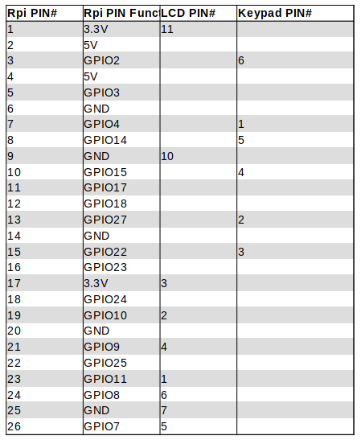
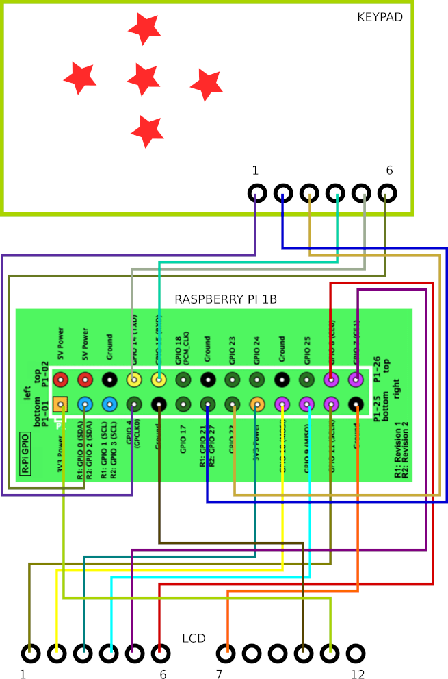
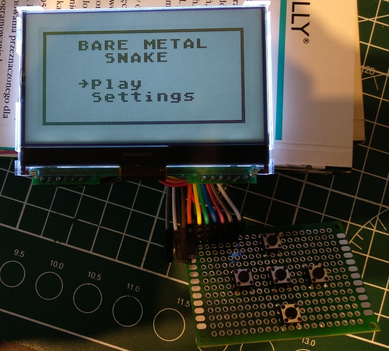
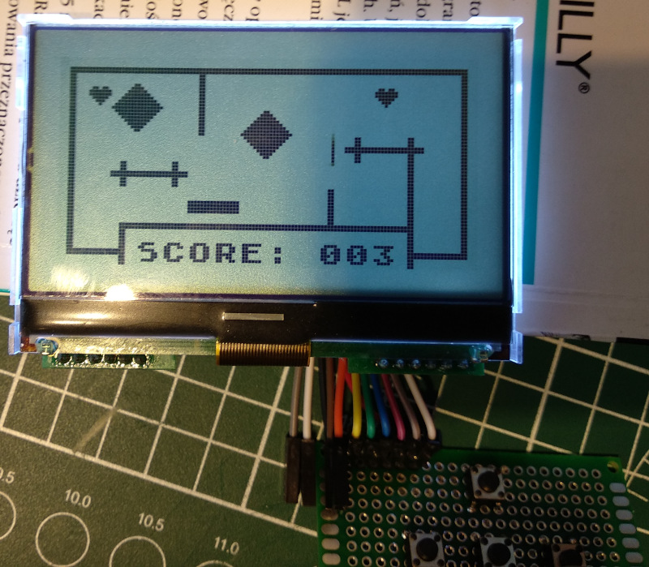
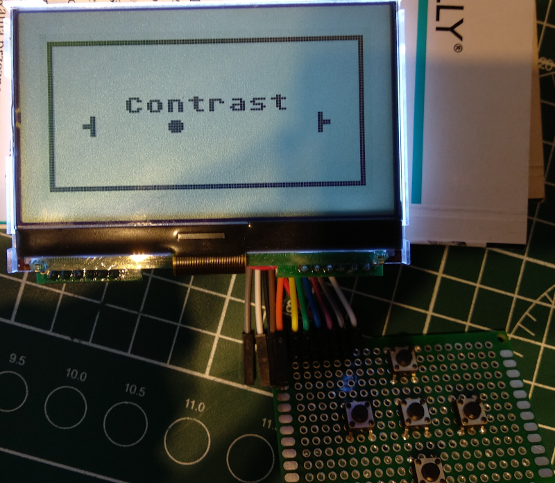

# BareMetalSnake
## Intro
Implementation of fast-paced game for bare-metal RaspberryPi 1 model B. You control player nicknamed 'Snake' whose goal is to collect all hearts placed on the sophisticated playground.

## Requirements
- RaspberyPi Model 1B
- Display based on ST7565P controller connected to SPI bus
- 5 buttons keypad

## Hardware

## Software
To properly build game, following packages are needed:
- Git (*sudo apt-get install git*)
- GNU Make (*sudo apt-get install make*)
- arm-none-eabi- GNU C for ARM compiler (*sudo apt-get install gcc-arm-none-eabi*)
- mtools (*sudo apt-get install mtools*)

Download or checkout sources, execute in *BareMetalSnake* directory:
> make

to compile and build SD card image. You can then use *dd* to write image to the SD card:

> dd if=img/sdcard.img of=/dev/sdX bs=1M

where */dev/sdX* denotes path to the SD card device.
